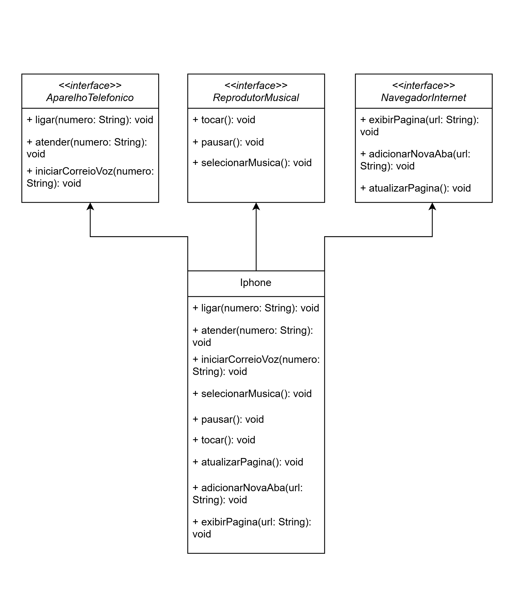

# 📱 Modelando o iPhone com UML  

## 📌 Diagrama UML  


🔹 Projeto para praticar **POO (Programação Orientada a Objetos)** e **modelagem UML**, representando as funções do iPhone:  
🎵 **Reprodutor Musical** | 📞 **Aparelho Telefônico** | 🌍 **Navegador na Internet**  

## 📂 Estrutura  

📁 **src/** → Classes e interfaces em Java  
📁 **diagrams/** → Arquivo do diagrama UML  

## 🚀 Tecnologias  

- ☕ **Java** – Lógica de programação e POO  
- 🎨 **UML** – Modelagem das classes e interfaces  
- 🛠 **VS Code** – IDE utilizada para o desenvolvimento  
- 📌 **[Draw.io/Lucidchart/etc.]** – Ferramenta usada para criar o diagrama

## ▶ Como Rodar  

1. Clone o repositório:  
   ```bash
   git clone https://github.com/Gabrieodev/Modelando-o-Iphone.git
   ```
2. Abra no VS Code e navegue até a classe `Main.java`.  
   Execute o método `main` para testar as funcionalidades.

## 🤝 Contribuições

💡 Sugestões e melhorias são bem-vindas! Siga os passos:

1. Faça um fork do projeto
2. Crie uma branch:
   ```bash
   git checkout -b minha-feature
   ```
3. Faça as alterações e commit:
   ```bash
   git commit -m 'Adicionando minha feature'
   ```
4. Envie para o repositório remoto:
   ```bash
   git push origin minha-feature
   ```
5. Abra um Pull Request 🚀

## 🧑‍💻 Autor

Desenvolvido por Gabrieodev 💻✨
